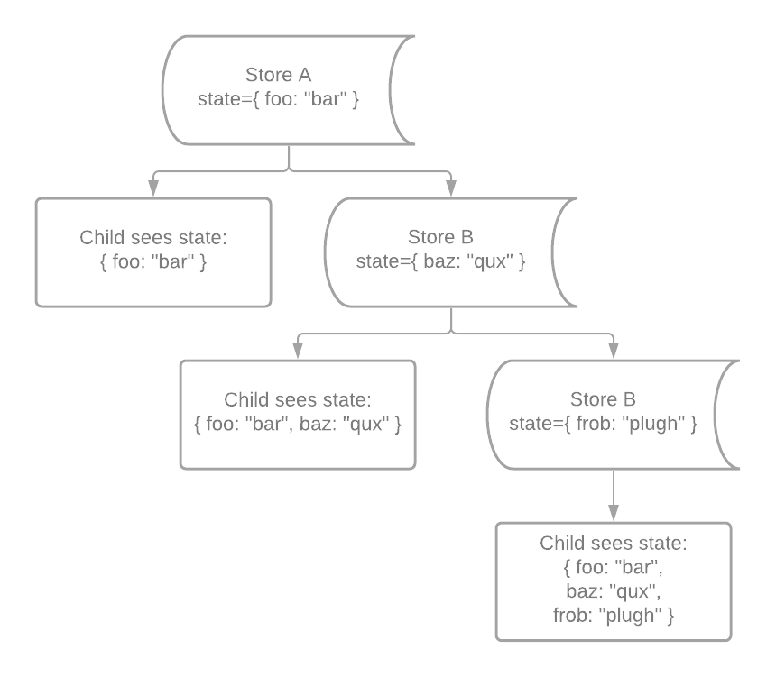
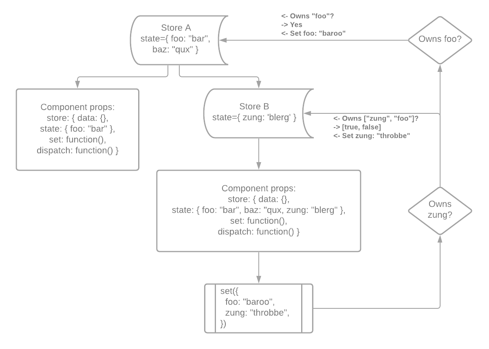
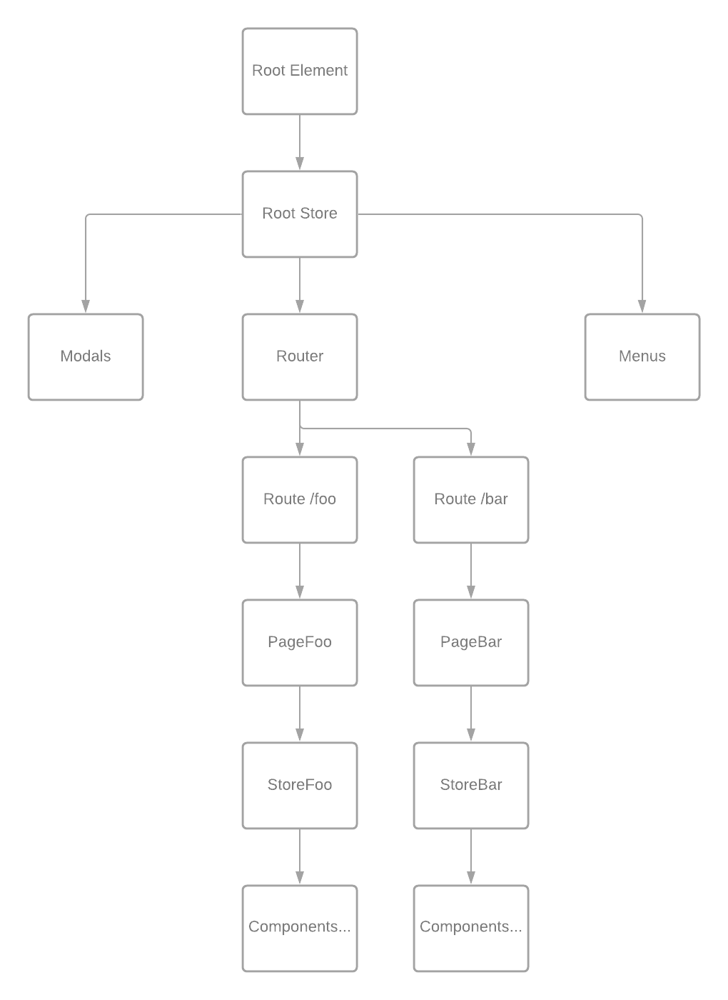

# Statium

Painless state management for React: pragmatic, non-opinionated, lightweight, blazing fast, natively asynchronous, 100% tested and with zero dependencies!

## Installation

`npm i statium` or `yarn add statium`

## Overview

State is contained in a Store, which is a React component implementing a hierarchically chained key/value storage with a few additional features. Child Components make use of the state values by reading from the Store and calling the provided setter function to update state values. Calling the setter function with a value will update the owner Store and re-render and its children components.



All Stores are connected in a chain from parent to child, and each child Store has access to its ancestors' keys throughout the tree. When a setter function is called, it will climb the `Store` tree, find stores that updated keys belong to, and update the state in these owners. State changes are always contained to the least possible component subtree, and only the affected subtree is rendered upon the change.



Besides managing state values, Store component implement handling _actions_ that help in managing asynchronous application logic flow. Action handler functions can access their owner Store state (and its parents' state), as well as updating state values and dispatching other actions.

## State management

Statium provides a simple and consistent API for initializing, accessing, and manipulating state values, supporting both functional and class based React components.

Statium Store itself is a React component that follows the common lifecycle. When a Store is mounted, it populates its state with the initial values provided in the `initialState` prop and sets up an object that is linked to parent Store's state object via prototype chain, so that every child component of a Store has access to all state values provided by parent Stores.
The state object's identity is stable and does not change throughout the Store lifecycle, ensuring that reading from it will produce current values after state updates have completed.

Reading state values is done directly from the state object, and if the key name is not defined in any parent Store, an exception will be thrown:

```javascript
import Store from 'statium';

const Component = () => (
  <Store tag="Grandparent" initialState={{ foo: "bar" }}>
    <Store tag="Parent" initialState={{ qux: "baz" }}>
    { ({ state }) => {
      console.log(`foo: ${state.foo}`); // bar
      console.log(`qux: ${state.qux}`); // baz
      console.log(`frob: ${state.frob}`); // throws an exception: key not found
    }}
    </Store>
  </Store>
);
```

Updating state values can be done by calling the `set` function:

```javascript
const Component = () => (
  <Store initialState={{ glop: "hloom" }}>
  { ({ state, set }) => (
    <>
      <div>glop: {state.glop}</div>

      <button onClick={() => set({ glop: "zorg" })}>
        zorg!
      </button>
    </>
  )}
  </Store>
);
```

The setter function accepts an object with key/value pairs to set. It will climb the Store chain, find the owner Stores for the keys and update their state with the provided values. Updates are batched so that even if more than one Store was updated, only one rendering will follow.

### Consuming state in child components

In order to support both functional and class based React code in a way that is convenient for each case, Statium provides more than one approach to consuming state contained in parent Stores. There are four options to consume Store state:

* By calling [`useStore` hook](docs/useStore.md) in functional components:

```javascript
import { useStore } from 'statium';

const Component = () => {
  const { data, state, set, dispatch } = useStore();

  ...
};
```

* By utilizing [`useState` hook](docs/useState.md) in functional components:

```javascript
import { useState } from 'statium';

const Component = () => {
  // API is similar to React.useState hook, with optional second argument
  // that defines the state key name for this value. This is useful for testing
  // as well as accessing this state in child components.
  const [foo, setFoo] = useState('qux', 'foo');

  return (
    <>
      <div>foo: {foo}</div>
      <button onClick={() => setFoo('plugh')}>Click me!</button>
    </>
  );
};
```

* By wrapping your components in a [`bind()`](docs/bindHoc.md) higher order component that accepts two optional arguments `mapStoreToProps` and `bindStoreToProps`:

```javascript
import { bind } from 'statium';

const Component = ({ foo, bar, setFoo }) => (
  { /*
    Do something to render foo and bar values;
    call setFoo(newValue) whenever foo needs to be updated
  */ }
);

const selectors = {
  foo: ({ state }) => state.foo,
  bar: ({ state }) => state.bar,
};

const actionables = {
  setFoo: ({ set }, value) => set({ foo: value }),
};

const ComponentWithStore = bind(selectors, actionables)(Component);
```

With no arguments, [`bind()`](docs/bindHoc.md) will simply inject the store API object as a prop in the wrapped component:

```javascript
import { bind } from 'statium';

const Component = ({ store: { data, state, set, dispatch } }) => (
  ...
);

const ComponentWithStore = bind()(Component);
```

* By using [`Bind`](docs/Bind.md) component with a child function that receives Store public API object:

```javascript
import Store, { Bind } from 'statium';

const Container = () => (
  <Store initialState={{ foo: "blerg" }}>
    <Component />
  </Store>
);

const Component = () => (
  <Bind>
  { ({ state, set }) => (
    <>
      <div>foo: {state.foo}</div>

      <button onClick={() => set({ foo: "krabble" })}>
        Click me!
      </button>
    </>
  )}
  </Bind>
);
```

All these except [`useState` hook](docs/useState.md) work in the same way: they find the nearest parent Store and return a reference to its public API object, or values from the Store ([`bind` HOC](docs/bindHoc.md)).

`useState` hook is a bit different: besides finding the nearest parent Store, it uses the parent to dynamically initialize a state key (once), and returns the current value as well as the setter function for this value. This API is very similar to `React.useState` hook, however the actual state values are kept in the parent Store with the corresponding ability to access them from outside of the component as well as providing the initial value that differs from the one hardcoded in the `useState` hook call. See more examples in [`useState` hook documentation](docs/useState.md).

### Initializing state

Store component accepts the `initialState` prop that should contain either an object with key/value pairs, or a function that returns an object with state keys and values; string and Symbol keys are supported. All keys that are provided by this Store should be present in the `initialState` prop object (or the result of initializer function invocation), and it is a good practice to set default values that make sense for your component.

There are two reasons for this requirement:
* The values provided by the Store might be used when rendering child Components, which is likely to happen shortly after rendering the Store itself within the same event loop.
* When updating state, Statium needs to find the Store that owns a key with the given name, so it should be present in the state of some Store up the tree. If the key name is not found, an exception will be thrown.

### Handling key name collisions

Prototype chaining of state objects makes it possible for a child Store to define a key with a name that one of the parent Stores already provides, and shadow the parent value with the child value. Most often this is accidental, and Statium will print a console warning indicating which parent Store defines the key and which child Store overrides it.

In order to make sure that no collisions are possible, use Symbol keys instead:

```javascript
const foo = Symbol('foo');
const qux = Symbol('qux');

const initialState = {
  [foo]: "bar",
  [qux]: 42,
};

const Component = () => (
  <Store initialState={initialState}>
  { ({ state: { [foo]: foo, [qux]: qux }) => {
    console.log(`foo: ${foo}, qux: ${qux}`); // foo: bar, qux: 42
  }}
  </Store>
);
```

### Dynamic state initialization

The initializer function will be called synchronously during Store construction and will be passed an object with two properties: `data` and `state`, containing the data provided by the Store that is being initialized and its parents, and state provided by the parent Stores. The state object returned from the initializer function should contain all keys and initial values provided by this Store.

```javascript
const initState = ({ data, state }) => {
  const { foo, bar } = readFromLocalStorage();

  return {
    foo,
    bar,
  };
};

const Component = () => (
  <Store initialState={initState}>
   { ... }
  </Store>
);
```

The initializer function is expected to be pure without side effects; if you need to perform some actions upon Store initialization, such as fetching data from the back end, use `React.useEffect` hook or some other option.

### Modifying Store state updates

What if we needed to apply some logic to `Store` state updates? Something simple like this: if `foo` changes, then `bar` needs to be set to `null`, or run validation function on every change, etc.

The `controlStateChange` prop allows doing this easily by executing the provided function on every Store state change _before_ the new values have been applied to the current state, and applying the result values to the _changeset_:

```javascript
const validateState = nextState => {
  const { password1, password2 } = nextState;

  if (password1 !== password2) {
    // The return value is an object and we don't have to return
    // full nextState object: only the actual bits that we want changed!
    // Returning the full state is not an error but it is not required.
    // This will be merged with nextState before updating the Store state.
    return {
      errors: ['Passwords do not match'],
    };
  }
};

const initialState = {
  password1: '',
  password2: '',
  errors: [],
};

const Component = () => (
  <Store initialState={initialState} controlStateChange={validateState}>
  { ({ state, set }) => (
    <Form>
      <PasswordInput label="Enter password"
          value={state.password1}
          onChange={value => { set('password1', value) }} />
      
      <PasswordInput label="Confirm password"
          value={state.password2}
          onChange={value => { set('password2', value) }} />
      
      { state.errors.map(error => <div>{error}</div>) }
    </Form>
  )}
  </Store>
);
```

See more in [Store documentation](docs/Store.md#controlStateChange).

## Read only data

In many cases, there is a need to give individual Components access to application state that is not managed by Statium, or bits of data available in some places up the tree. A feature flag option from external service, URI parameters if you are using `react-router`, or simply a value calculated somewhere that you need to spread to child components; Statium makes this easy by passing an object with key/value pairs in the `data` prop to a Store:

```javascript
const Container = ({ foo, bar }) => (
  <Store data={{ foo, bar }}>
  { ({ data }) => {
    // This will print the current values of foo and bar
    // passed into Container props every time it is rendered
    console.log(`foo: ${data.foo}`);
    console.log(`bar: ${data.bar}`);
  }}
  </Store>
);
```

Like state, data is hierarchical: all child Stores have access to the data key/value pairs provided by their parent Stores. Like state, the `data` object passed in the public Store API is stable and can be read from synchronously.

Unlike state, data is not managed by the Store and cannot be modified by calling `set()`; use action handlers instead to update the original source of that data key (e.g. URI parameter). Data is always current and reading from the `data` object always returns the values that were passed to the Store providing these values at the time it was last rendered. This is also unlike state which is initialized only once.

It is possible to have some Stores in the component tree to provide only data, and some only state, and some a combination of both (or neither); there are no limitations.

## Statium and URL routing

Stores naturally follow the tree structure of React components that comprise your application and make it easy to compartmentalize the state with the components that use it. When a Store is not rendered its state does not exist; when a Store is unmounted its state is destroyed and garbage collected. This is particularly useful when the application state needs to be synchronized with the page URL.

Supposing that in the example diagram below, the `Router` component will render either `PageFoo` or `PageBar` components based on the URL route and correspondingly, either `StoreFoo`'s or `StoreBar`'s state will exist at any given time:



In this example we are using `react-router` and Statium to make global route parameters available throughout the application. Note that we are passing these parameters to the Store `data` instead of state; this is because URL routing parameters are external to Statium and cannot be managed as a piece of internal state.

```javascript
import Store from 'statium';
import { Switch, Route as BaseRoute } from 'react-router-dom';

import PageFoo from './PageFoo.js';
import PageBar from './PageBar.js';

const Route = ({ children, moduleId, ...props }) => (
  <BaseRoute {...props}
    render={({ history, location, match }) =>
      // tag prop is optional, it helps with development and testing
      <Store tag="Route" data={{ moduleId, history, location, ...match.params }}>
        { children }
      </Store>
    }
  />
);

const Application = () => (
  <Switch>
    <Route moduleId="foo" path="/foo/:fooId/:tabId">
      {/* keys `fooId` and `tabId` are available in Store's data */}
      <PageFoo />
    </Route>

    <Route moduleId="bar" path="/bar/:barId/:subpageId">
      {/* keys `barId` and `subpageId` are available in Store's data */}
      <PageBar />
    </Route>
  </Switch>
);
```

The URL parameters are then available in Store's `data` in every child of the respective Route regardless of the component tree depth:

```javascript
const PageFoo = () => {
  <Bind>
  { ({ data, state }) => {
    // e.g. URL is /foo/123/xyz
    console.log(`${data.moduleId}, ${data.fooId}, ${data.tabId}`); // foo, 123, xyz
  }}
  </Bind>
});
```

### Handling transient state

Most pages in a Web application have some sort of state that is local to that page and cannot be based on the URL routing, e.g. transient input form values. Some of these values can be exposed as optional parameters in the application URL `search` portion to improve user experience, e.g. sort-by and sort order in a table, selected tab in a modal, etc.

The fact that Store is a React component make it very easy to initialize its local state from the URL when the parent component is rendered by passing an initializer function in the `initialState` prop. Persisting local state changes to the URL is equally easy done by using the optional `onStateChange` observer function that Store calls upon completing a state change. This function, if provided, is called synchronously after the Store state update has been completed. The only argument to the observer is the public Store API object; is not expected to return a value.

A helper library for working with the URI search params such as [`urlito`](https://github.com/statiumjs/urlito) makes this short and easy to read:


```javascript
import Store from 'statium';
import stateToUri from 'urlito';
import Table from 'some-ui-framework';

// Defaults are assumed if URL search params are not present
const defaultState = {
  sortColumn: 'column1',
  sortOrder: 'asc',
};

const [getStateFromUri, setStateToUri] = stateToUri(defaultState);

const SortedTable = () => (
  <Store initialState={getStateFromUri} onStateChange={setStateToUri}>
  { ({ state: { sortColumn, sortOrder }, set }) => (
    <Table sortColumn={sortColumn} onSortColumnChange={sortColumn => set({ sortColumn })}>
      <Column sortOrder={sortOrder} onSortOrderChange={sortOrder => set({ sortOrder })}>
        ...
      </Column>
    </Table>
  )}
  </Store>
);
```

In this example, `getStateFromUri` and `setStateToUri` functions returned by the `stateToUri` wrapper are used to initialize Store state by reading from URI search params and update URI search params when Store state has changed, respectively.

## Synchronous read, asynchronous write

Statium Store supports three types of operations: reading from the store, updating the store, and dispatching actions. Reading store values is a normal JavaScript object property lookup operation, it is most often used during child components' rendering phase and is always synchronous.

Calling `set` function to update the store is always an asynchronous operation; this is different from many other state management libraries. When `set` is called with new values, it will schedule an update that is not guaranteed to happen in the same event loop cycle and therefore the calling code cannot expect the state to be synchronously updated. To solve this problem, `set` function will return a Promise that is guaranteed to be resolved when Store state is completely updated:

```javascript
import { fetchPayload } from 'some-package';

const PayloadPage = ({ payload }) => (
  <div>
    Payload: {payload}
  </div>
);

const LoadingPage = () => (
  <Store initialState={{ loading: false, payload: null }}>
  { ({ state, set }) => (
    <div>
      { state.loading
          ? <span>Loading...</span>
          : <PayloadPage payload={state.payload} />
      }

      <button onClick={
        async () => {
          // This will update state, cause a rendering, and wait until the Promise
          // is resolved which happens after rendering is finished.
          await set({ loading: true });

          // At this point the state object is guaranteed to be updated,
          // and we can read current state values directly from it:
          console.log(state.loading); // true

          const payload = await fetchPayload();

          // We can update multiple state values at once. While this time awaiting
          // for the Promise to resolve is not exactly necessary, it is
          // still a good practice in case you will need to add code below later.
          await set({
            loading: false,
            payload,
          });
        }
      }>
        Load data
      </button>
    </div>
  )}
  </Store>
);
```

Dispatching actions works in a similar way: `dispatch` is always asynchronous and returns a Promise that is resolved when action handler function finishes. This makes it easy to dispatch other actions from action handlers, and wait for the results before proceeding with the original action.

```javascript
import { anotherAction } from './another.js';

const actionHandler = async ({ state, set, dispatch }) => {
  await set({ foo: 'bar' });

  // By the time dispatch() function is called, the state object will have been
  // updated with the new value, so reading from it will produce 'bar'.
  await dispatch(anotherAction, state.foo);

  ...
};
```

The `dispatch` function also makes it easy to declutter component code and avoid inlining event handlers. Calling `dispatch` with the first argument being a function will schedule an invocation of that function and pass the public Store API to it when it is called, e.g. the payload fetching example above can be rewritten to look much cleaner and be more testable:

```javascript
import { fetchPayload } from 'some-package';

// Logic can be easily tested in isolation
export const load = async ({ state, set }) => {
  await set({ loading: true });

  console.log(state.loading); // true

  const payload = await fetchPayload();

  await set({
    loading: false,
    payload,
  });
};

const PayloadPage = ({ payload }) => (
  <div>
    Payload: {payload}
  </div>
);

const LoadingPage = () => (
  <Store initialState={{ loading: false, payload: null }}>
  { ({ state, dispatch }) => (
    <div>
      { state.loading
          ? <span>Loading...</span>
          : <PayloadPage payload={state.payload} />
      }

      <button onClick={() => dispatch(load)}>Load data</button>
    </div>
  )}
  </Store>
);
```

# Actions in depth

Besides state and data, practically any application will have some business logic in it that is too complex to fit into "read this value", "set that value" pattern. In Statium, cases like accessing server side APIs, performing multiple logical steps, etc. are handled by dispatching _action handlers_ in a way that is easy to develop, read, and test.

## Action handlers

An action handler is simply an asynchronous function that accepts one or more arguments, where the first argument is always a reference to a Store public API object:

```javascript
const actionHandler = async ({ data, state, set, dispatch }, ...args) => {
  ...
};
```

Actions are dispatched from components by passing the action handler function to the `dispatch` function provided in the Store public API object:

```javascript
import Store from 'statium';

const action = async ({ data, state, set, dispatch }) => {
  ... // do something
};

const Component = () => (
  <Store>
  { ({ data, state, set, dispatch }) => (
    <button onClick={() => dispatch(action)}>
      Click me!
    </button>
  )}
  </Store>
);
```

Action handlers can dispatch other actions using the same approach:

```javascript
import { someOtherHandler } from './otherActions.js';

const actionHandler = async ({ data, state, set, dispatch }, ...args) => {
  const result = await dispatch(someOtherHandler, ...args);
};
```

## Why dispatching?

Looking at the examples above, it might seem more natural to simply call the action handler functions directly instead of passing them to `dispatch`. While this is indeed possible, dispatching actions has numerous benefits that are either not easy or too tedious to implement manually every time:

* Dispatched action handlers are deferred to the next event loop cycle instead of being called immediately, providing for better UI responsiveness;
* Action handlers are automatically buffered: each time an action is dispatched, previous scheduled invocation is cancelled and replaced with the last one;
* If the Store that schedules actions was unmounted before actions have had a chance to be invoked, all pending actions are cancelled;
* When action handler function is called, it is guaranteed to receive the valid public API object of the Store that it was dispatched from, with stable identities of `data` and `state` objects;
* If an action handler function dispatches other actions with the `dispatch` function it receives from the public API object, other actions are also managed the same way;
* If the dispatching Store is unmounted while the asynchronous action handler code is being executed, trying to access the Store (read, set, or dispatch) will throw a `StoreUnmountedError` exception to interrupt the flow;
* Finally, exceptions thrown while executing asynchronous action handler code are caught by the dispatching Store and are handled.

## Error handling

In Statium, errors in action code are first class citizens. Store action scheduler will catch exceptions and Promise rejections in asynchronous action handler functions and handle them in the following way:

* Exceptions of type `StoreUnmountedError` that are thrown when trying to access already unmounted Store are suppressed: there is not much choice of what to do in that case;
* Other exceptions cause Store render and are rethrown during rendering so that parent `ErrorBoundary` can catch and handle them;
* Promise returned from `dispatch` is rejected to propagate flow interruption upstream.

```javascript
import { StoreUnmountedError } from 'statium';

const action = async ({ state, set }) => {
  await set({ foo: "bar" });

  try {
    const response = await fetchServerData();

    await set({ data: response?.data });
  }
  catch (error) {
    if (!(error instanceof StoreUnmountedError)) {
      await set({ error });
    }
  }
};
```

# RealWorld example

To give you an idea on how Statium can help with developing simple, easy to read, and testable React applications, take a look at the [React/Statium RealWorld demo](https://github.com/statiumjs/realworld-example).
